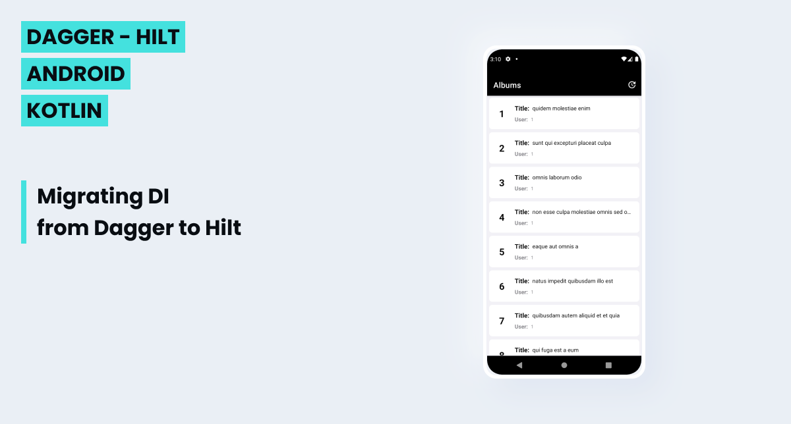

# Migrating DI from Dagger to Hilt

Criei este projeto para aplicar meus conhecimentos sobre como migrar um App Android que utiliza Injeção de Dependência com Dagger para Injeção de Dependência com Hilt.
Como ponto de partida, utilizei um App meu que usa Injeção de Dependência com Dagger (disponível no meu repositório: [kotlin-android-retrofit-coroutines-clean-mvvm-dagger-room](https://github.com/ericksavluchinske/kotlin-android-retrofit-coroutines-clean-mvvm-dagger-room)).
O App consome uma API REST utilizando Retrofit, Kotlin Coroutines, Clean Architecture + MVVM, Dagger, Room, DataBinding, RecyclerView.
Ele foi desenvolvido utilizando a linguagem de programação Kotlin e a arquitetura Clean Architecture + MVVM.
O Aplicativo consiste em um App Android nativo, o qual possui uma simples tela que exibe uma lista de álbuns fornecida pela API [JSONPlaceHolder](https://jsonplaceholder.typicode.com/).
O App consome os dados da API referida e os salva em um banco de dados local (Room) para permitir consulta offline e evitar várias requisições para a API.
Na mesma tela, também há um botão que permite atualizar a lista de álbuns realizando novamente o consumo de dados da referida API.
#### Obs: O passo a passo da migração Dagger para Hilt se encontra disponível nos commits deste projeto.

## ⚙️ Funcionalidades

- [x] Exibe uma lista de álbuns fornecida pela API [JSONPlaceHolder](https://jsonplaceholder.typicode.com/)
- [x] Salva os dados consumidos da referida API em um banco de dados local (Room) para permitir consulta offline e evitar várias requisições para a API.
- [x] Permite atualizar, através de um botão, a lista de álbuns realizando novamente o consumo de dados da referida API.

## 🛠 Tecnologias

- Android Studio
- Kotlin
- Retrofit
- Kotlin Coroutines
- Clean Architecture + MVVM
- Hilt
- Room
- DataBinding
- RecyclerView

## 🎨 Design

Utilizei o Figma para criar o layout do projeto.

## 👋 Autor - Erick Savluchinske

- LinkedIn: [https://www.linkedin.com/in/ericksavluchinske](https://www.linkedin.com/in/ericksavluchinske)
- GitHub: [https://github.com/ericksavluchinske](https://github.com/ericksavluchinske)

## 📝 Licença

Licença [MIT](./LICENSE).

Feito com ❤️ por Erick Savluchinske [Entre em contato!](https://www.linkedin.com/in/ericksavluchinske)
